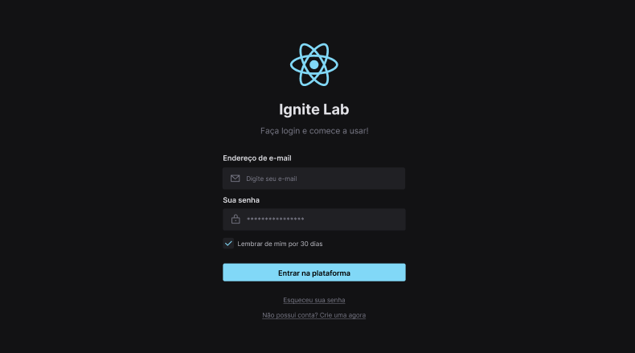
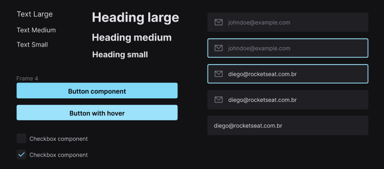

# (Para estudo) Ignite Lab Design System ⚛

Um projeto desenvolvido durante o Ignite Lab 03, apresentado pela Rocketseat. Focado em ensinar sobre Design System.





[Link do Storybook](https://brendon3578.github.io/study-ignite-lab-design-system/)

## ⚙ Tecnologias Utilizadas

- Figma (Utilizado para criar o Layout e o Design System)
  - Criação de tokens
  - Plugin Phosphor Icons
  - Plugin Color Styleguide
- React
  - Vite
  - Tailwind Css
- Storybook (Organização e Convenção de componentes para o Design System)
**- Addons:**
  - Jest
  - Test Runner
  - Testing Library
  - MSW Storybook addon
  - Builder Vite

## 🔮 Aprendizado

Alguns dos conteúdos novos que eu aprendi durante as aulas:

**Pattern de composição** - Agrupação de componentes dentro de um único componente

*\src\components\TextInput\TextInput.tsx*

```tsx
  export const TextInput = {
    Root: TextInputRoot,
    Input: TextInputInput,
    Icon: TextInputIcon,
  };
```

*\src\pages\SignIn\SignIn.tsx*

```tsx
  <label htmlFor="password" className="flex flex-col gap-1 lg:gap-3">
    <Text className="font-semibold">Sua senha</Text>
    <TextInput.Root>
      <TextInput.Icon>
        <Lock />
      </TextInput.Icon>
      <TextInput.Input
        id="password"
        type="password"
        placeholder="***********"
      />
    </TextInput.Root>
  </label>

```

## 🎈 Análise do aprendizado

Quando se trata de Design Systems, é bastante vantajosa quando se tem um contexto de uma aplicação que possui muitos componentes, e quando há várias equipes front-end trabalhando em diversos projetos utilizando o mesmo conjunto de estilização.

A utilização de classes utilitárias do Tailwind CSS é bastante útil com o uso de componentes que o React JS permite.

Como última análise pessoal, é ainda mais vantajoso o uso do Atomic Design (que é um Design System) aplicado juntamente ao TailwindCss, React, e o Storybook, visto que essa metodologia é facilmente aplicada quando é utilizado as ferramentas citadas anteriormente.

## 🚀 Como executar

```bash
    # Clonar o repositório
    $ git clone https://github.com/Brendon3578/study-ignite-lab-design-system/

    # Entrar no diretório
    $ cd lab-design-system
    
    # Instalar as dependências
    $ yarn install
    # ou
    $ npm run

    # Iniciar o projeto
    $ yarn dev
    # ou
    $ npm run dev

    # Iniciar o Storybook
    $ npm run storybook
    # ou
    $ yarn storybook
```

---

<h3 align="center">
    Feito com ☕ por <a href="https://github.com/Brendon3578"> Brendon Gomes</a>
</h3>